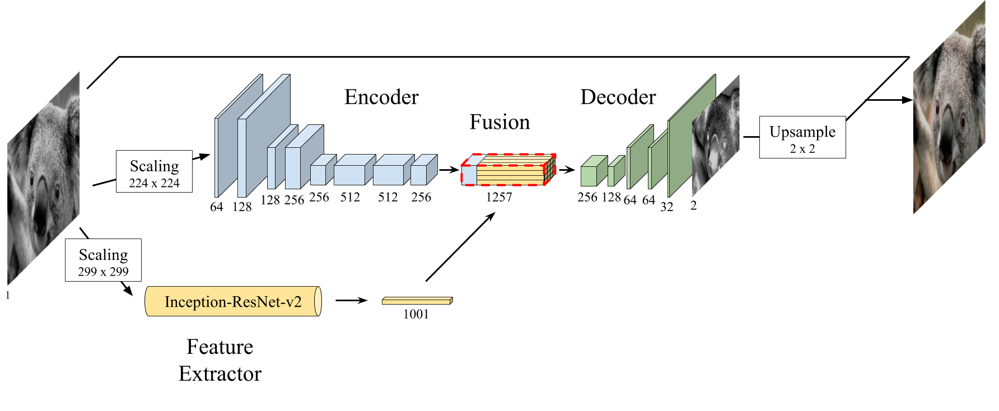

# Deep Koalarization
#### Image colorization using deep CNN and features extracted from Inception-ResNet-v2
This project was developed as part of the [DD2424 Deep Learning in Data Science course](https://www.kth.se/student/kurser/kurs/DD2424?l=en) at [KTH Royal Institute of Technology](http://kth.se), spring 2017.

| Author               | GitHub                                            |
|:---------------------|:--------------------------------------------------|
| Federico Baldassarre | [baldassarreFe](https://github.com/baldassarreFe) |
| Diego Gonzalez Morin | [diegomorin8](https://github.com/diegomorin8)     |
| Lucas Rodés Guirao   | [lucasrodes](https://github.com/lucasrodes)       |

## Intro
We got the inspiration from the work of Richard Zhang, Phillip Isola and Alexei A. Efros, who realized a network able to colorize black and white images ([blog post](http://richzhang.github.io/colorization/) and [paper](https://arxiv.org/abs/1603.08511)). They trained a network on ImageNet pictures preprocessed to make them grayscale, with the colored image as the output target.

Then we also saw the experiments of Satoshi Izuka, Edgar Simo-Serra and Hiroshi Ishikawa, who added image classification features to raw pixels fed to the network, improving the overall results ([YouTube review](https://www.youtube.com/watch?v=MfaTOXxA8dM), [blog post](http://hi.cs.waseda.ac.jp/~iizuka/projects/colorization/en/) and [paper](http://hi.cs.waseda.ac.jp/~iizuka/projects/colorization/data/colorization_sig2016.pdf)).

## Network
In our work we implement a similar architecture, enriching the pixel information of each image with semantic information about its content. However, object recognition is already a complex problem and would be worth a project on its own.
For this reason we are not going to build an image classifier from scratch. Instead we will use a network that has already been trained on a large variety of images, such as Google’s Inception model or AlexNet, both trained on ImageNet. Adapting pre trained models and using them as feature extractor for other tasks is the base concept of transfer learning.

The hidden layers of these models learned to create a semantic representation of the image that is then used by the final layer (fully connected + softmax) to label the objects in the image. By “cutting” the model at one of its final layers we will get a high dimensional representation of image features, that will be used by our network to perform the colorization task (TensorFlow [tutorial](https://www.tensorflow.org/tutorials/image_retraining) on transfer learning, another [tutorial](https://kwotsin.github.io/tech/2017/02/11/transfer-learning.html) and arXiv [paper](https://arxiv.org/abs/1403.6382)).

The _fusion_ between the fixd-size embedding and the intermediary result of the convolutions is performed by means of replication and stacking as described in the original paper:

## Dataset
Training data for this experiment could actually come from every source, but we rather prefer using images from ImageNet, which nowadays is considered the de-facto reference for image tasks. It will also make our experiments easily reproducible, compared to using our own images.

## Software packages
We will be working with Python 3, for it is widely used in the data science and machine learning communities.

As for additional libraries, for machine learning, deep learning and image manipulation we will use TensorFlow, NumPy/SciPy, Scikit, Pillow, etc.

## Training and Evaluation
In this project, we deal with a regression problem, where we want to estimate the colors of a picture given a grayscale version of it. The regression task is performed by a Deep Network and can be expressed as a function _F_.

We can train our network in a supervised fashion, employing two images for each sample: the grayscale (_X_) and the original version (_Y_). After training, the network should be able to approximate the function _Y= F(X)_.

In order to find an optimal model parameter setting by means of backpropagation, we need to compute the dissimilarity between the network output and the original image, a loss function in the form:

_L{F(X), Y} = L{Y, Y}._

A common choice for this loss function in regression tasks is the Mean Square Error.
