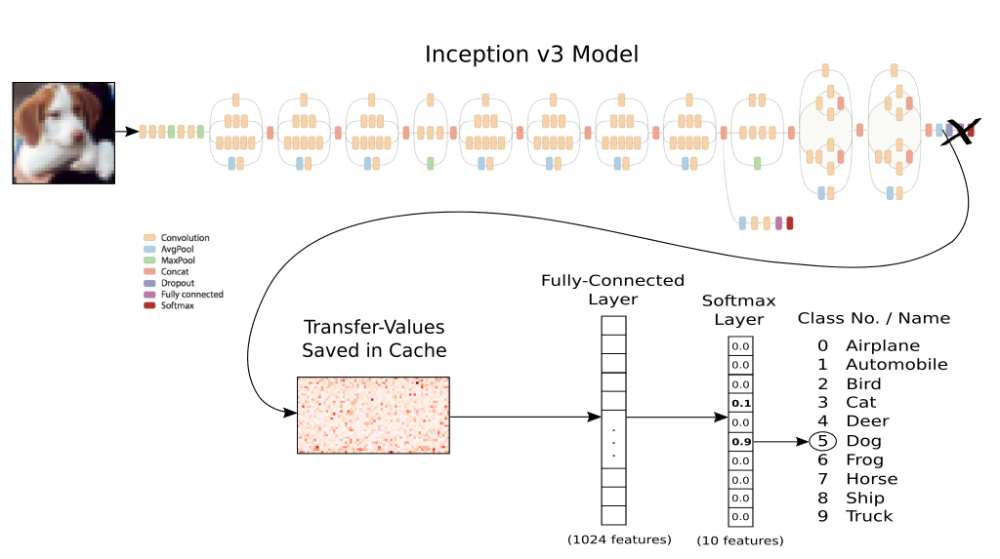

# *#roadmap*

These are the macro steps that we'll need to take in order to conclude the project. Each one is accompanied by a small description and a set of questions.

## Data Preparation

### 1 Download images from ImageNet
We need to download the raw images from ImageNet because we'll apply filters on them. At the same time it will be useful to have a bundled (single sequential file) version of the dataset, so that disk reads will be faster during training.

* All the images are probably too many to handle, we need to decide which subset to use, whether we want to focus on a few subjects or
* Where to get the JPEG images, what folder structure works best for our task?
* What is the bundled format that works for TensorFlow and friends?
* Are the images the same size, do we need to do padding and resizing?

### 2 Apply filters
To create our dataset we need to apply Instagram-like filters on the individual images. Then, the ideal would be to re-bundle all these images in a single sequential file for faster training.

* How many different filters do we want to apply, what are their parameters?
* What library will we use to apply the filters
* What is the ideal folder structure for our task?

### 3 Pre-compute and cache the feature vectors from Inception
We've read that running the Inception model at training time is going to be slow. A much better option is to first run the feature extraction once per image and save the resulting vector for later use.

A good explanation can be found in [this repo by Hvass Laboratories](https://github.com/Hvass-Labs/TensorFlow-Tutorials/blob/master/08_Transfer_Learning.ipynb). He focuses on using Inception as feature extractor to build a custom classifier (transfer learning). We are going to extract the same features, but use them as additional information for our network.

## Training

### 4 Define different network architecture
Once the data is ready we want to try different network architectures, varying the number of convolutional layers, the size of the convolutions, various batch normalization, regularization, dropout options etc.

An interesting test to do is to see how adding the Inception features improves the performances of the network. For this reason we could first train a network without those feature and see how it goes and then train a complete model.

### 5 Train on the supercomputer
Having defined different network architectures and checked that there are not errors during training (we can do this on a local computer, with a few images and on a few training cycles), we can now move the training on a supercomputer. Here the larger amount of RAM and the GPUs available will make the training viable.

* How do we transfer/download the images on the supercomputer?
* How do we automate the creation of the filtered images?
* How long is the training going to take? Do we need to scale down the dataset?
* What metrics do we want to keep about one training experiment?

## Having fun

### 6 Testing our best network on real images
Once we have a model that performs well enough we could try to run it on real images taken from Instagram (or the internet in general) and visually evaluate the results.

* The images we download are not going to be the same size as our dataset, we will need to resize/pad them
